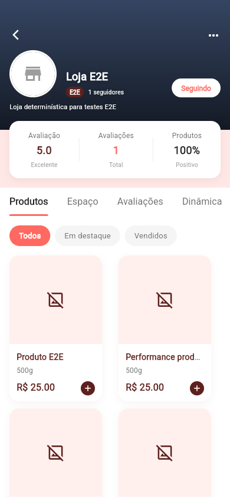
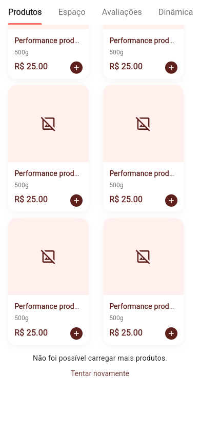

# Desempenho do Nhac — 03/10/2026

Base: `fix/ux-estados-e-erros`, commit `f0e6114b33108f3b24550d48fb9fa9e0b4aea89f`. Branch: `perf/latencia-tcc`.

| Fluxo | Alteração |
|---|---|
| Loja | Exibe a primeira página de 50 produtos; carregar mais é explícito. Deduplica IDs e preserva cards quando a página seguinte falha |
| Relacionados | Usa lojaAberta já enviado no catálogo; elimina GET por loja |
| Home | Refresh inicia pedidos e catálogo sem aguardar GPS; GPS tem limite de 8 s |
| Rastreio | Mostra o pedido antes de aguardar loja, rota e mapa |
| Busca | Publica resultado antes de gravar cache local; mantém proteção contra resposta de busca antiga |
| Cache HTTP | Invalidação por caminho não descarta cache de outro recurso em andamento; resposta antiga não repovoa cache |
| Usuário/endereço | GETs equivalentes compartilham operação e cache da sessão |
| Catálogo público | Não adiciona token nos GETs públicos de cards e lista de lojas; pedidos e minha-loja continuam autenticados |
| Inicialização | Push inicializa após primeiro frame; Sentry recebe falhas; traces em release amostram 10% |
| Checkout | Reserva confirmada com gateway indisponível abre recuperação pelo pedidoId, sem outro POST automático |

O backend deve ser publicado antes deste app: os novos GETs são /produtos/cards e /produtos/cards/promocoes. Os endpoints completos existentes continuam disponíveis no backend.

## Verificação

- Flutter test: 218 testes passaram na execução final, incluindo o botão de paginação.
- Flutter analyze: nenhum erro ou warning; 34 avisos de estilo informativos já presentes nos arquivos da branch.
- Build web de produção gerado. O dry-run de WASM reporta dependências de mapas/JS incompatíveis; o build JavaScript final passou.
- Auditoria de contratos strict: zero achados. O auditor cobre contratos e HTML/JS, não analisa Dart; testes Flutter e navegador são a evidência funcional.
- DESIGN.md lint: zero erros e warnings. Os contratos existentes foram preservados e ampliados para paginação e recuperação.
- Navegador Chromium com fixtures locais: login, home, primeira página, falha simulada de página seguinte, retry da mesma página via Tab/Enter, loading e lista vazia. A sequência observada foi 0, 1, 1.
- Viewport 390x844 e inspeção 1280x900. A tela ampla ainda evidencia limitações existentes de escala/altura do ScreenUtil e do cabeçalho fixo da loja; esta rodada não certifica responsividade de todo o app.
- Paginação mantém botão com tamanho mínimo e foco visível; o estado ocupado impede nova carga.

O teste da barra de navegação agora usa um adapter de catálogo vazio: isola o teste de UI de timeouts reais e fecha a árvore ao terminar.

## Evidência visual

Primeira página:



Falha posterior preservando cards:



Loading e vazio também foram exercitados, usando respostas controladas em banco e API de teste. As imagens usam apenas dados sintéticos.

## Reproduzir a conferência web

Gerar o build web e servi-lo em http://localhost:3000. Rodar o backend isolado em http://127.0.0.1:8089 com perfil e2e e o catálogo sintético descrito no relatório do backend. Os scripts interceptam o asset .env somente no navegador de teste, apontando para a API local e ativando E2E_MODE.

Instalar Playwright em uma pasta de ferramentas, instalar Chromium e suas dependências; executar os scripts com NODE_PATH apontando para os node_modules dessa instalação:

```sh
NODE_PATH=/tmp/nhac-browser/node_modules node tool/verify_perf_ui.cjs
NODE_PATH=/tmp/nhac-browser/node_modules node tool/verify_perf_empty.cjs
```

Os scripts usam a credencial pública da fixture E2E, nunca a conta de produção. Screenshots são gravados em /tmp/nhac-perf-ui por padrão.

Para SQL, medição HTTP, hospedagem e limites da conciliação, consultar [o relatório do backend](https://github.com/NhacDelivery/backend-nhac/blob/perf/latencia-tcc/docs/performance.md).
